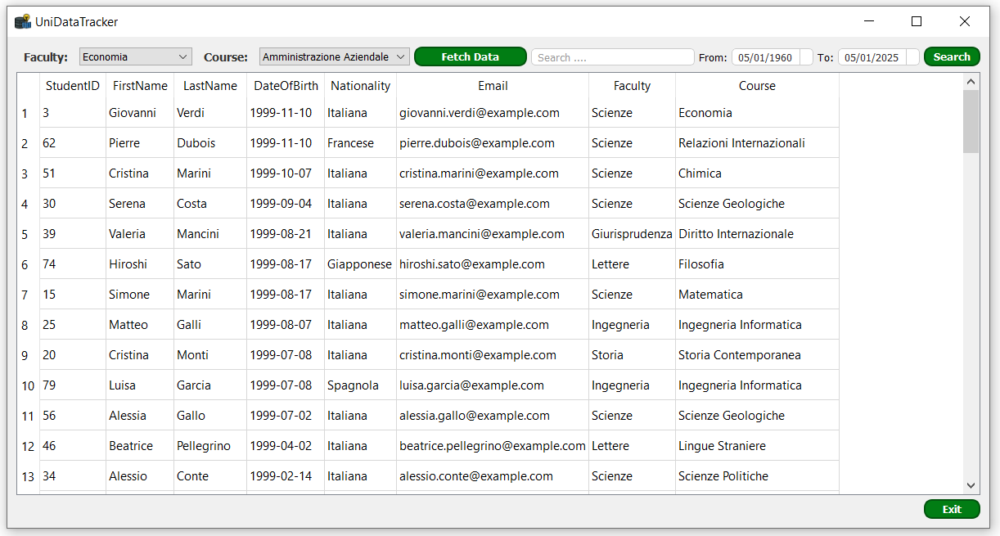

#   StudentTrackApp

**StudentTrackApp** is an intuitive and user-friendly application designed to manage and track student information using **SQL Server** and **PyQt5**. This application enables users to select courses and faculties, perform detailed searches, retrieve data from the database, and display the results in a clear and organized manner.

## Project Objectives
The goals of this project are to:
- **Establish a connection between a Python GUI application and SQL Server**: Demonstrate how to connect a GUI developed in Python to a SQL Server database.
- **Explore PyQt5 and its functionalities and style sheets**: Investigate the capabilities of PyQt5 for building intuitive and visually appealing user interfaces.
- **Learn how to produce an executable application after project completion**: Understand the process of packaging a Python application into a standalone executable.

## Features

- **Course and Faculty Selection**: Easily select and manage faculties and courses.
- **Detailed Search**: Perform detailed searches with multiple filters, including date ranges.
- **Data Retrieval**: Retrieve and display student information in a structured format.
- **User-Friendly Interface**: Designed with an intuitive and easy-to-navigate interface using PyQt5.
- **Secure Configuration**: Securely manage database connection settings.

## Installation

To install and run StudentTrackApp, follow these steps:

### Step 1: Create the Database
First, create a new database in SQL Server. You can name it `StudentDB` or any name of your choice.

### Step 2: Create the Student Table
Create a table named `anagrafica_studenti` in your database with the following fields:

```sql
CREATE TABLE anagrafica_studenti (
    StudentID INT PRIMARY KEY,
    FirstName NVARCHAR(50),
    LastName NVARCHAR(50),
    DateOfBirth DATE,
    Nationality NVARCHAR(50),
    Email NVARCHAR(100),
    Faculty NVARCHAR(100),
    Course NVARCHAR(100)
);
```

### Step 3: Insert Initial Records
Insert initial records into the `anagrafica_studenti` table for testing purposes:

```sql
INSERT INTO anagrafica_studenti (StudentID, FirstName, LastName, DateOfBirth, Nationality, Email, Faculty, Course)
VALUES 
(1, 'John', 'Doe', '2000-01-01', 'American', 'john.doe@example.com', 'Science', 'Biology'),
(2, 'Jane', 'Smith', '1999-05-15', 'Canadian', 'jane.smith@example.com', 'Engineering', 'Computer Science');
```

### Step 4: Clone the Repository and Open it in Your IDE
Clone the repository and open it in your IDE, like PyCharm.


### Step 5: Configure the Database Connection
Update the `config.ini` file with your database connection settings:

```ini
[Database_Con]
Server = YOUR_SERVER_NAME
Database = StudentDB
UID = YOUR_USER_ID
PWD = YOUR_PASSWORD
```

## Usage

1. **Run the application**:
    ```bash
    python ssms.py
    ```

2. **Navigate the UI**:
    - Select the faculty and course from the dropdown menus.
    - Use the search bar and date range filters to perform detailed searches.
    - Click "Fetch Data" to retrieve and display the student information.

<div style="text-align: center;">

</div>

## Building the Executable

To create an executable for StudentTrackApp using `cx_Freeze`, follow these steps:

1. **Install cx_Freeze**:
    ```bash
    pip install cx_Freeze
    ```

2. **Run the setup script**:
    ```bash
    python setup.py bdist_msi
    ```

The executable will be created in the `build` and `dist` directories.


